# 📋 API de Asistencia - Documentación Completa

## 🎯 Endpoints Disponibles

### 1. **POST /api/v1/attendance** - Marcar Asistencia
### 2. **GET /api/v1/attendance/group/:groupId/date/:date** - Asistencia por Grupo y Fecha
### 3. **GET /api/v1/attendance/week/:weekId** - Asistencia de Semana
### 4. **GET /api/v1/attendance/week/:weekId/patient/:patientId** - Asistencia de Paciente en Semana
### 5. **GET /api/v1/attendance/:id** - Obtener Asistencia Específica
### 6. **PATCH /api/v1/attendance/:id/lock** - Bloquear Asistencia
### 7. **POST /api/v1/attendance/week/:weekId/lock-all** - Bloquear Todas las Asistencias
### 8. **POST /api/v1/attendance/absence/justify** - Justificar Ausencia
### 9. **GET /api/v1/attendance/:id/absence-reasons** - Razones de Ausencia
### 10. **DELETE /api/v1/attendance/absence-reasons/:reasonId** - Eliminar Razón de Ausencia
### 11. **GET /api/v1/attendance/patient/:patientId/stats** - Estadísticas de Paciente

---

## 🔥 **ENDPOINT PRINCIPAL: Marcar Asistencia**

### **POST /api/v1/attendance**

**Propósito:** Marcar la asistencia de un paciente en una fecha específica

**Autenticación:** JWT Bearer Token requerido

**Roles:** ADMIN, THERAPIST, NURSE

---

### 📋 **Request Body**

```json
{
  "patientId": "uuid-del-paciente",
  "weekId": "uuid-de-la-semana",
  "attendanceDate": "2025-01-15",
  "status": "P",
  "unitsAttended": 4,
  "notes": "Paciente participó activamente en todas las actividades"
}
```

### 🔍 **Parámetros Detallados**

| Campo | Tipo | Requerido | Descripción | Valores Válidos |
|-------|------|-----------|-------------|-----------------|
| `patientId` | string (UUID) | ✅ | ID del paciente | UUID válido |
| `weekId` | string (UUID) | ✅ | ID de la semana | UUID válido |
| `attendanceDate` | string (ISO date) | ✅ | Fecha de asistencia | YYYY-MM-DD |
| `status` | string | ✅ | Estado de asistencia | `P` (Presente), `A` (Ausente), `D` (Discharge) |
| `unitsAttended` | number | ✅ | Unidades asistidas | 0-8 |
| `notes` | string | ❌ | Notas adicionales | Máximo 500 caracteres |

---

### 📤 **Response (201 Created)**

```json
{
  "id": "attendance-uuid-123",
  "patientId": "patient-uuid-456",
  "weekId": "week-uuid-789",
  "attendanceDate": "2025-01-15T00:00:00.000Z",
  "status": "P",
  "unitsAttended": 4,
  "notes": "Paciente participó activamente en todas las actividades",
  "isLocked": false,
  "createdAt": "2025-01-15T10:30:00.000Z",
  "updatedAt": "2025-01-15T10:30:00.000Z",
  "patient": {
    "id": "patient-uuid-456",
    "patientNumber": "P100",
    "firstName": "María Elena",
    "lastName": "Rodríguez García"
  },
  "absenceReasons": []
}
```

---

### ❌ **Errores Posibles**

#### **400 Bad Request**
```json
{
  "message": [
    "patientId must be a UUID",
    "status must be one of the following values: P, A, D",
    "unitsAttended must be between 0 and 8"
  ],
  "error": "Bad Request",
  "statusCode": 400
}
```

#### **401 Unauthorized**
```json
{
  "message": "Token de autorización inválido o expirado",
  "statusCode": 401
}
```

#### **403 Forbidden**
```json
{
  "message": "No tienes permisos para marcar asistencia",
  "statusCode": 403
}
```

#### **404 Not Found**
```json
{
  "message": "Paciente no encontrado",
  "statusCode": 404
}
```

---

## 🆕 **ENDPOINT NUEVO: Asistencia por Grupo y Fecha**

### **GET /api/v1/attendance/group/:groupId/date/:date**

**Propósito:** Obtener la asistencia de todos los pacientes de un grupo en una fecha específica

**Autenticación:** JWT Bearer Token requerido

**Roles:** ADMIN, THERAPIST, NURSE

---

### 📋 **Parámetros de URL**

| Parámetro | Tipo | Descripción | Ejemplo |
|-----------|------|-------------|---------|
| `groupId` | string (UUID) | ID del grupo | `aaede735-375a-4ee7-afa1-438ae2d57199` |
| `date` | string (ISO date) | Fecha en formato YYYY-MM-DD | `2025-01-15` |

---

### 📤 **Response (200 OK)**

```json
{
  "groupId": "aaede735-375a-4ee7-afa1-438ae2d57199",
  "date": "2025-01-15",
  "dayOfWeek": "Wednesday",
  "attendances": [
    {
      "id": "attendance-uuid-1",
      "patientId": "patient-uuid-1",
      "patientName": "María Elena Rodríguez García",
      "patientNumber": "P100",
      "status": "P",
      "unitsAttended": 4,
      "isLocked": false,
      "absenceReason": {
        "id": "reason-uuid-1",
        "reasonType": "medical_appointment",
        "startDate": "2025-01-15",
        "endDate": "2025-01-15",
        "notes": "Cita médica programada"
      }
    },
    {
      "id": "attendance-uuid-2",
      "patientId": "patient-uuid-2",
      "patientName": "Ana Martínez López",
      "patientNumber": "P004",
      "status": "A",
      "unitsAttended": 0,
      "isLocked": false,
      "absenceReason": {
        "id": "reason-uuid-2",
        "reasonType": "family_trip",
        "startDate": "2025-01-15",
        "endDate": "2025-01-17",
        "notes": "Viaje familiar"
      }
    },
    {
      "id": null,
      "patientId": "patient-uuid-3",
      "patientName": "Carlos Pérez",
      "patientNumber": "P005",
      "status": "A",
      "unitsAttended": 0,
      "isLocked": false,
      "absenceReason": undefined
    }
  ],
  "summary": {
    "totalPatients": 6,
    "presentCount": 4,
    "absentCount": 2,
    "dischargeCount": 0,
    "attendanceRate": 66.67
  }
}
```

---

### 🔍 **Estructura de Response Detallada**

#### **Objeto Principal**
| Campo | Tipo | Descripción |
|-------|------|-------------|
| `groupId` | string | ID del grupo consultado |
| `date` | string | Fecha consultada (YYYY-MM-DD) |
| `dayOfWeek` | string | Día de la semana en español |
| `attendances` | array | Lista de asistencias de pacientes |
| `summary` | object | Resumen estadístico |

#### **Objeto Attendance**
| Campo | Tipo | Descripción |
|-------|------|-------------|
| `id` | string \| null | ID de la asistencia (null si no hay registro) |
| `patientId` | string | ID del paciente |
| `patientName` | string | Nombre completo del paciente |
| `patientNumber` | string | Número de paciente |
| `status` | string | Estado: `P` (Presente), `A` (Ausente), `D` (Discharge) |
| `unitsAttended` | number | Unidades asistidas (0-8) |
| `isLocked` | boolean | Si la asistencia está bloqueada |
| `absenceReason` | object \| undefined | Razón de ausencia si aplica |

#### **Objeto AbsenceReason**
| Campo | Tipo | Descripción |
|-------|------|-------------|
| `id` | string | ID de la razón de ausencia |
| `reasonType` | string | Tipo de razón |
| `startDate` | string | Fecha de inicio (YYYY-MM-DD) |
| `endDate` | string \| undefined | Fecha de fin (opcional) |
| `notes` | string \| undefined | Notas adicionales |

#### **Objeto Summary**
| Campo | Tipo | Descripción |
|-------|------|-------------|
| `totalPatients` | number | Total de pacientes en el grupo |
| `presentCount` | number | Pacientes presentes |
| `absentCount` | number | Pacientes ausentes |
| `dischargeCount` | number | Pacientes dados de alta |
| `attendanceRate` | number | Porcentaje de asistencia (0-100) |

---

## 🔧 **Implementación en Frontend**

### **TypeScript Interfaces**

```typescript
// attendance.types.ts
export interface Attendance {
  id: string | null;
  patientId: string;
  patientName: string;
  patientNumber: string;
  status: 'P' | 'A' | 'D';
  unitsAttended: number;
  isLocked: boolean;
  absenceReason?: {
    id: string;
    reasonType: string;
    startDate: string;
    endDate?: string;
    notes?: string;
  };
}

export interface GroupDateAttendance {
  groupId: string;
  date: string;
  dayOfWeek: string;
  attendances: Attendance[];
  summary: {
    totalPatients: number;
    presentCount: number;
    absentCount: number;
    dischargeCount: number;
    attendanceRate: number;
  };
}

export interface MarkAttendanceRequest {
  patientId: string;
  weekId: string;
  attendanceDate: string;
  status: 'P' | 'A' | 'D';
  unitsAttended: number;
  notes?: string;
}
```

### **Servicio de Asistencia**

```typescript
// attendance.service.ts
export class AttendanceService {
  private readonly BASE_URL = '/api/v1/attendance';

  /**
   * Marcar asistencia de un paciente
   */
  async markAttendance(data: MarkAttendanceRequest): Promise<Attendance> {
    return apiClient.post<Attendance>(
      this.BASE_URL,
      data,
      true // requiresAuth
    );
  }

  /**
   * Obtener asistencia de un grupo en una fecha específica
   */
  async getGroupDateAttendance(
    groupId: string, 
    date: string
  ): Promise<GroupDateAttendance> {
    return apiClient.get<GroupDateAttendance>(
      `${this.BASE_URL}/group/${groupId}/date/${date}`,
      true // requiresAuth
    );
  }

  /**
   * Obtener asistencia de una semana
   */
  async getWeekAttendance(weekId: string): Promise<Attendance[]> {
    return apiClient.get<Attendance[]>(
      `${this.BASE_URL}/week/${weekId}`,
      true
    );
  }

  /**
   * Bloquear asistencia
   */
  async lockAttendance(attendanceId: string): Promise<void> {
    return apiClient.patch<void>(
      `${this.BASE_URL}/${attendanceId}/lock`,
      {},
      true
    );
  }

  /**
   * Justificar ausencia
   */
  async justifyAbsence(data: {
    attendanceId: string;
    reasonType: string;
    startDate: string;
    endDate?: string;
    notes?: string;
  }): Promise<void> {
    return apiClient.post<void>(
      `${this.BASE_URL}/absence/justify`,
      data,
      true
    );
  }

  /**
   * Obtener estadísticas de un paciente
   */
  async getPatientStats(
    patientId: string,
    startDate?: string,
    endDate?: string
  ): Promise<{
    totalDays: number;
    present: number;
    absent: number;
    discharge: number;
    totalUnits: number;
  }> {
    const params = new URLSearchParams();
    if (startDate) params.append('startDate', startDate);
    if (endDate) params.append('endDate', endDate);
    
    return apiClient.get<any>(
      `${this.BASE_URL}/patient/${patientId}/stats?${params.toString()}`,
      true
    );
  }
}
```

### **Ejemplo de Uso**

```typescript
// attendance.component.ts
export class AttendanceComponent {
  constructor(private attendanceService: AttendanceService) {}

  async markPatientAttendance(patientId: string, weekId: string) {
    try {
      const attendance = await this.attendanceService.markAttendance({
        patientId,
        weekId,
        attendanceDate: '2025-01-15',
        status: 'P',
        unitsAttended: 4,
        notes: 'Participación excelente'
      });
      
      console.log('Asistencia marcada:', attendance);
    } catch (error) {
      console.error('Error al marcar asistencia:', error);
    }
  }

  async getGroupAttendance(groupId: string, date: string) {
    try {
      const data = await this.attendanceService.getGroupDateAttendance(groupId, date);
      
      console.log(`Día: ${data.dayOfWeek}`);
      console.log(`Pacientes presentes: ${data.summary.presentCount}`);
      console.log(`Tasa de asistencia: ${data.summary.attendanceRate}%`);
      
      // Filtrar solo pacientes presentes
      const presentPatients = data.attendances.filter(a => a.status === 'P');
      console.log('Pacientes presentes:', presentPatients);
      
    } catch (error) {
      console.error('Error al obtener asistencia:', error);
    }
  }
}
```

---

## 🎯 **Casos de Uso Comunes**

### **1. Marcar Asistencia Diaria**
```typescript
// Marcar que un paciente asistió 4 unidades
await attendanceService.markAttendance({
  patientId: 'patient-uuid',
  weekId: 'week-uuid',
  attendanceDate: '2025-01-15',
  status: 'P',
  unitsAttended: 4
});
```

### **2. Marcar Ausencia con Justificación**
```typescript
// Marcar ausencia
await attendanceService.markAttendance({
  patientId: 'patient-uuid',
  weekId: 'week-uuid',
  attendanceDate: '2025-01-15',
  status: 'A',
  unitsAttended: 0
});

// Justificar la ausencia
await attendanceService.justifyAbsence({
  attendanceId: 'attendance-uuid',
  reasonType: 'medical_appointment',
  startDate: '2025-01-15',
  endDate: '2025-01-15',
  notes: 'Cita médica programada'
});
```

### **3. Obtener Resumen de Grupo**
```typescript
// Obtener asistencia de todo el grupo
const groupData = await attendanceService.getGroupDateAttendance(
  'group-uuid',
  '2025-01-15'
);

// Verificar si hay suficientes pacientes para generar nota
if (groupData.summary.presentCount > 0) {
  console.log('Se puede generar nota del día');
} else {
  console.log('No hay pacientes presentes');
}
```

### **4. Generar Nota Solo con Pacientes Presentes**
```typescript
const groupData = await attendanceService.getGroupDateAttendance(
  'group-uuid',
  '2025-01-15'
);

// Filtrar solo pacientes presentes
const presentPatients = groupData.attendances.filter(a => a.status === 'P');

if (presentPatients.length > 0) {
  // Generar nota solo con pacientes presentes
  await notesService.generateDayNote({
    groupId: 'group-uuid',
    noteDate: '2025-01-15',
    patients: presentPatients
  });
}
```

---

## 🔒 **Seguridad y Validaciones**

### **Autenticación**
- Todos los endpoints requieren JWT Bearer Token
- Token debe estar en el header: `Authorization: Bearer <token>`

### **Autorización**
- **ADMIN:** Acceso completo a todos los endpoints
- **THERAPIST:** Puede marcar asistencia de sus grupos
- **NURSE:** Puede marcar asistencia de sus grupos

### **Validaciones de Datos**
- `patientId` debe ser UUID válido
- `status` debe ser 'P', 'A', o 'D'
- `unitsAttended` debe estar entre 0 y 8
- `attendanceDate` debe ser fecha válida en formato ISO
- `notes` máximo 500 caracteres

### **Reglas de Negocio**
- No se puede marcar asistencia en fechas futuras
- No se puede modificar asistencia bloqueada
- Un paciente no puede tener múltiples asistencias el mismo día
- Las unidades asistidas deben ser consistentes con el estado

---

## 📊 **Estados de Asistencia**

| Estado | Código | Descripción | Unidades Típicas |
|--------|--------|-------------|------------------|
| **Presente** | `P` | Paciente asistió | 1-8 |
| **Ausente** | `A` | Paciente no asistió | 0 |
| **Discharge** | `D` | Paciente dado de alta | 0 |

---

## 🚀 **Mejores Prácticas**

### **Frontend**
1. **Validar datos antes de enviar**
2. **Mostrar loading states durante las operaciones**
3. **Manejar errores de manera user-friendly**
4. **Confirmar antes de bloquear asistencias**
5. **Usar debounce para búsquedas**

### **Backend**
1. **Validar permisos antes de procesar**
2. **Usar transacciones para operaciones críticas**
3. **Logear todas las operaciones importantes**
4. **Implementar rate limiting**
5. **Validar integridad de datos**

---

## 🔄 **Flujo Completo de Asistencia**

```mermaid
graph TD
    A[Usuario inicia sesión] --> B[Selecciona grupo y fecha]
    B --> C[Obtiene lista de pacientes]
    C --> D[GET /attendance/group/:groupId/date/:date]
    D --> E[Mostrar lista de asistencias]
    E --> F{Usuario marca asistencia?}
    F -->|Sí| G[POST /attendance]
    F -->|No| H[Continuar con otros pacientes]
    G --> I{Asistencia exitosa?}
    I -->|Sí| J[Actualizar UI]
    I -->|No| K[Mostrar error]
    J --> L{¿Bloquear asistencias?}
    L -->|Sí| M[PATCH /attendance/:id/lock]
    L -->|No| N[Continuar]
    M --> O[Asistencias bloqueadas]
    N --> P[Proceso completado]
```



---

## 📝 **Notas Importantes**

1. **Fechas:** Siempre usar formato ISO (YYYY-MM-DD)
2. **IDs:** Todos los IDs deben ser UUIDs válidos
3. **Unidades:** Máximo 8 unidades por día
4. **Bloqueo:** Una vez bloqueada, la asistencia no se puede modificar
5. **Ausencias:** Se pueden justificar después de marcar como ausente
6. **Estadísticas:** Se calculan automáticamente en tiempo real

---

## 🆘 **Solución de Problemas**

### **Error 400: Datos inválidos**
- Verificar formato de UUIDs
- Validar rango de unidades (0-8)
- Confirmar formato de fecha

### **Error 401: No autorizado**
- Verificar que el token JWT sea válido
- Confirmar que el token no haya expirado
- Revisar formato del header Authorization

### **Error 403: Sin permisos**
- Verificar rol del usuario
- Confirmar que el usuario tenga acceso al grupo
- Revisar permisos de la clínica

### **Error 404: No encontrado**
- Verificar que el paciente exista
- Confirmar que la semana esté activa
- Revisar que el grupo esté activo

---

*Documentación actualizada: Enero 2025*
*Versión API: 1.0*
